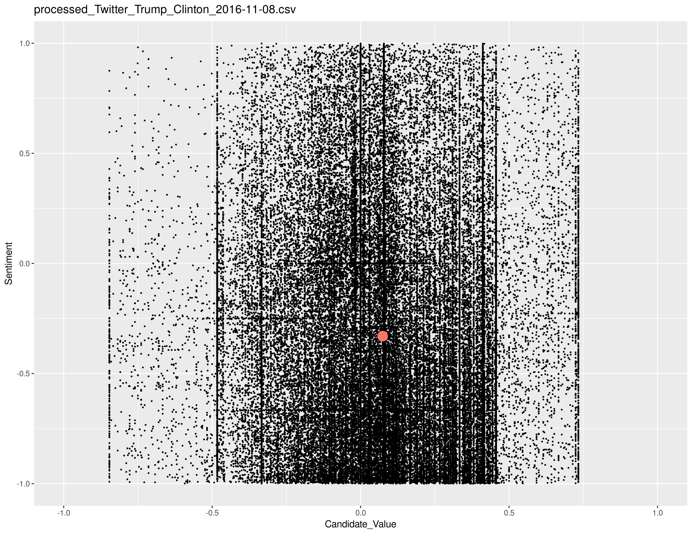
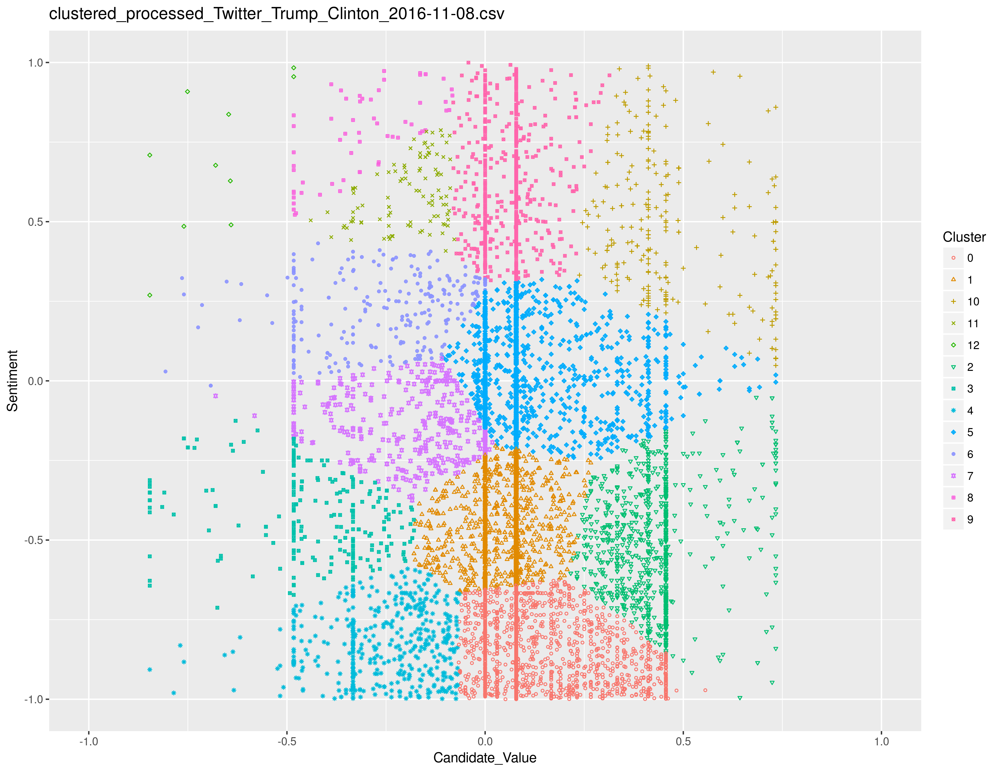

# Twitter Presidential Race Sentiment Clustering

Last Updated: **December 4, 2016**

Lead Maintainers: [Rafael Zamora](https://github.com/rz4), [Justin Murphey](https://github.com/KingMurphy)

## Overview
The goal of this project is to analyze Twitter data from the 2016 United States presidential race.
We hope to discover classes of tweets by applying clustering techniques on the
sentiment of the tweets and how much they reference either the Republican or Democrat
candidates. The generated clusters and their sizes will then be used to analyze the
tweeting behavior over the last few weeks of the election. We hope to see how
specific events during the race influence Twitter's sentiment towards either candidate.

Data was gathered from 3 weeks prior to the election and 1 week after the election.The data was pulled from Twitter using Python with the following parameters:

- **Start Date**: 2016-10-16
- **End Date**: 2016-11-14
- **Keywords**: @hillaryclinton OR #hillaryclinton OR Hillary Clinton OR Hillary OR @RealDonaldTrump OR #donaldtrump OR Donald Trump OR Trump

The following values were gathered from each tweet:

- Author-ID
- Date with Time
- Text

The following is an example of a tweet and the values produced through processing:
- **Tweet text**: Donald Trump Angry at Mike Pence For Doing Great Job At Vice Presidential Debate.
- **Noun Phrases**: [ 'donald trump angry', 'mike pence',  'job', 'vice presidential debate' ]
- **Sentiment Value**: 0.803
- **Clinton Reference Value**: 0.263
- **Trump Reference Value**: 0.800
- **Candidate Reference Value**: -0.537*

*-1 = Trump, 1 = Clinton

SciKitLearn's **Birch Clustering** algorithm was used to cluster the processed data.
The following are graph examples of processed and clustered data:

## Getting Started

#### Requirements:

Requires Python 3.5 and R.

Requires the following Python Packages:

- [GOT3](https://github.com/Jefferson-Henrique/GetOldTweets-python) (modified version is included in [/src/](src))
- [TextBlob](https://pypi.python.org/pypi/textblob)
- [scikit-learn](https://pypi.python.org/pypi/scikit-learn/0.18.1)

#### Setup and Installation:

To install download or clone repository and install required packages.

The [/src/](src) folder includes all scripts used for this project. The following
are short descriptions of each script:

- [PullTwitterData.py](src/PullTwitterData.py) - Used to pull and write data to CSV
- [ProcessTwitterData.py](src/ProcessTwitterData.py) - Used to process and run sentiment analysis on pulled data
- [ClusterTwitterData.py](src/ClusterTwitterData.py) - Used to run Birch clustering on processed data
- [GraphTwitterData.R](src/GraphTwitterData.R) - Used to export PNG graphs of processed and clustered data

The [/doc/](doc) folder contains an R [Notebook](doc/Notebook.Rmd) used for analyzing
data and results. It also contains [/figures/](doc/figures) folder which includes graphs of all processed and
clustered data.

The [/data/](data) folder contains pre-processed and processed Twitter data while the
final clustered data can be found in the [results](/results/) folder.

Cluster sizes and centroid coordinates can be found in
[results.txt](results/results.txt)

## License

This project is licensed under the [MIT License](LICENSE).

#### Citation

[CITATION](CITATION) provides how to cite this project.
